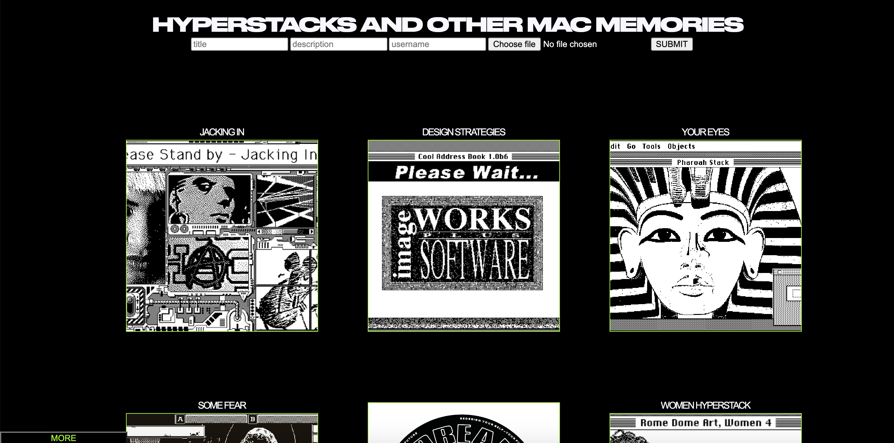

# imageboard

'HYPERSTACKS AND OTHER MAC MEMORIES' is Single Page Application that allows users to upload images with description and title as well as leave comments. 

STACK
• HTML5, CSS, Javascript
• PostgreSQL Database
• Express.js on Node.js
• vue.js 
• AWS S3 Cloud Storage

